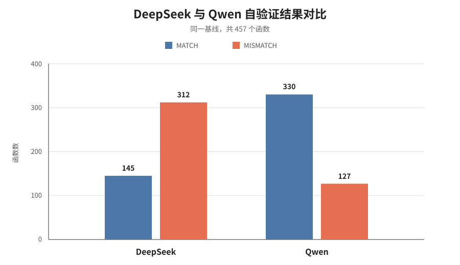

# FM-Agent 自验证

如果一个工具能够理解大型软件、为函数生成规约，再判断代码是否遵守规约，那么有最有意思的问题是：**它能否分析自己？**

这一次，我们把 FM-Agent 的工作目录转为它自身。

被放上验证台的，变成了 FM-Agent 自己的代码、工作流和解析器。它一边扮演审查者，一边成为被审查者；一边写下“这段程序应该怎样运行”，一边接受来自自身推理链的质问。

## 警报响起之后

本轮自验证基于 7.29 的代码基线 `abc1f89` 展开，接入的是 deepseek-v4-pro 模型。FM-Agent 共分析了 457 个函数，最初给出 145 个 `MATCH` 和 312 个 `MISMATCH`。

Validator 随后用反例程序逐项复现 `MISMATCH`，得到 262 个 `confirmed` 和 50 个 `not_confirmed`。然而，`confirmed` 依然并非真实的 Bug 判据，它只能说明：在某个生成的规约和特定测试前提下，代码与规约发生了可复现的冲突。可能是规约写得太强，又或许是 Mock 构造了真实调用链永远不会出现的状态，解析器也可能被要求完成一项它从未承诺过的任务。

于是，数字开始一层层退潮。

先是通过 Codex 过滤了 76 条推理误判和 94 条 SPEC 错误，这种错误是由于 SPEC 生成过强或者推理逻辑链有误，可以直接丢弃；再去掉大概率不是 Bug 和影响很小的条目（一般是安全性校验的误判等），只留下 62 条进入逐条 Review。最终在人工代码审查下，清单收敛为 18 条实现缺陷和 1 条仍需真实 CodeGraph 场景确认的问题。其中 225 和 239 指向同一次数据丢失的上下游环节，合并后对应 17 个独立实现缺陷。

从 312 到 19，缩减了 93.9%。但这并不意味着前面的 293 条毫无价值：它让我们看见了自动验证最容易混淆的三件事：规约是否正确、反例是否可达、差异是否真的有影响，这也正是误报率居高不下的主要成因。只有当 FM-Agent 做到降低误报、精简输出，它才能真正在工程上可用。

## 自递归的魔咒？

第一轮自验证过程中，有十个函数没有得到完整结果，并且整个 `fm_agent/` 目录发生丢失。检查 Dashboard 的执行记录后发现，Validator 为验证 `run_incremental_pipeline()`，直接将 FM-Agent 仓库作为 `proj_dir` 传入，在验证任务内部再次启动了 FM-Agent 增量自验证。

当外层流程仍在读取当前 `fm_agent/` 中的规约和验证结果，内层增量工作流却把相同目录当作工作区。这会导致内层重建验证产物：检测不到完整历史基线时（后续函数还未完整生成 SPEC），它会携带 `proj_dir` 回退到 `run_pipeline()` 进行验证，而这一步会清除原本不完整的 `fm_agent/` 目录，进而发生丢失。这属于**工作流级递归重入**。

为什么验证全量函数 `run_pipeline()` 不会发生这种情况呢？因为这时候 probe 只需要 mock 一个很简单的项目目录即可。但是 `run_incremental_pipeline()` 作为增量验证函数，会需要要求传入更多的参数，例如 `old_commit` 等标记上一次 base 的参数。这也要求构造的目录必须包含 Git 历史，对于 probe 的构造要求就更高，于是 LLM 会选择更简单的方式——传入当前工作目录，然后发生错误。

为避免再次发生，self-validation guard 禁止 probe 在构造验证反例时调用 `run_pipeline()`、`run_incremental_pipeline()`、`main.py`、FM-Agent CLI 或 OpenCode，也禁止使用活动仓库及其 `fm_agent/` 作为测试工作区。相关行为应通过 mock 和最小 fixture 验证；无法脱离完整工作流复现的结论应标记为 `NOT CONFIRMED`。

## 假阳性来自何处？

312 条 `MISMATCH` 最终缩减为 18 条实现缺陷和 1 条待确认项，误报率逼近 93.9%，这究竟是为什么？

问题出在证据链的起点。自动生成的 SPEC 容易把常见工程偏好写成强制契约，例如要求输出保持固定顺序、任何异常都转换成指定返回值，或者强制规定文件合法性检查。Reasoner 随后依据这些要求报告差异，Validator 又围绕同一要求构造反例。于是三者可以得到一致的结论并提出 `MISMATCH`，却不保证这项要求来自文档或真实调用方，而其仅仅由 LLM 给出。

函数级验证还会削弱调用链中的前置条件。内部函数在生产流程中可能只接收字符串、已注册语言或经过 schema 校验的数据，probe 却能通过 Mock 注入任意类型和不可达状态。这样的反例足以触发异常，但无法单独证明真实工作流会遇到同一问题。另一些条目确有机制上的缺陷，但只影响极端环境、展示信息或低概率降级路径，更适合进入低优先级维护清单。

我们可以进一步分析当前 FM-Agent 实现的特质：

1. 当前流程很擅长回答：

   > 能不能构造一个输入，让实现不满足这条 SPEC？
   >

   但真正重要的问题是：

   > 为什么这条 SPEC 应当成立？
   >

   这就是 SPEC 过强导致误报率过高的最重要原因。
2. Mock 提高了 Validator 的成功率，但也扩大了语义空间，让 Validator 构造出真实工作流无法到达的 probe。
3. 高假阳性主要集中在以下情况：

   - 私有 helper；
   - 格式、排序、异常类型等非核心语义；
   - 外部工具缺失的 fallback；
   - 依赖 Mock 才能出现的状态。

其实后续两点也是建立在第一点之上：例如，mock 出来的反例满足 Reasoner 的冲突描述，但是不满足 SPEC 规定好的 precondition；辅助函数里的假阳性来自对 caller 行为的不明确，也是由于 SPEC 分析的问题。

那么问题就演变为了，如何写好 SPEC？这一点恰恰反映在了 FM-Agent 接入 Claude 模型效果会更好这一点上，完全依赖模型自身去判断并生成一个好的 SPEC，这种不确定性的偏差似乎是 LLM 的必然。

## 不同模型的影响对比

为了观察模型对结果的影响，我们又使用 qwen-3.8-max，在同一代码基线的 457 个函数上完成了一轮自验证。DeepSeek 给出 312 个 `MISMATCH`，Qwen 则给出 127 个。

| Verdict 转移                         | 函数数 |
| ------------------------------------ | -----: |
| 两个模型均为`MISMATCH`             |    108 |
| DeepSeek`MISMATCH`，Qwen `MATCH` |    204 |
| DeepSeek`MATCH`，Qwen `MISMATCH` |     19 |

DeepSeek 中消失的 204 条 `MISMATCH`，其中 165 条在先前审计中被归为 SPEC 错误或推理误判，这说明 Qwen 消除了相当大的噪声。但剩余部分还包括一些实现缺陷候选，甚至有一些包含在最后19条人工校验结果中，值得我们进一步思考match的可信度。

FM-Agent 当前采取的步骤是：模型同时生成 SPEC、推导实现的实际行为、用 reasoner 比较差异、最后 validator 构造反例。更换模型不仅改变了代码推理能力，也改变了输入范围、异常语义和输出格式等生成要求。也就是说，模型既参与寻找反例，也参与定义反例所违反的标准，最后更接近“实现与本轮生成的 SPEC 自洽”，而不是对代码正确性的独立证明。

Qwen 的 `MISMATCH` 更少并不代表它的 SPEC 一定更加贴合实际语境。统计上，Qwen 的 SPEC 相对更长，也更频繁使用 `exactly`、异常行为等强断言。更可能的原因是，它在 SPEC 和实际行为推导两个阶段采用了更一致的描述，同时对 caller 已保证的数据格式写入了更具体的前置条件，并且没有进行过强的断言影响结果。DeepSeek 则更容易在上下游描述之间引入不同强度的假设，从而产生更多冲突。低误报率在这里首先说明跨阶段更自洽，对于 SPEC 跨层传播更加稳定，证明了模型在 FM-AGENT 验证中的影响。

在 DeepSeek 判为 `MATCH`、Qwen 判为 `MISMATCH` 的 19 个函数中，逐项复核后只有 3 个能够确认是实现缺陷，另有 2 个依赖尚未明确的跨平台契约，其余 14 个属于 SPEC 错误或推理误判。例如，Qwen 要求 Erlang 的降级函数捕获 `SystemExit` 等 `BaseException`，要求 symlink 指向同一目录时必须共享分析缓存，要求 `messages_to_prompt` 拼接多个文本块时不能插入换行，还把最终由 caller 完成的 CodeGraph 重名去重错误地下推给 `get_function_spans`。这些反例都能制造局部差异，有些甚至被 Validator 标为 `confirmed`，但被违反的要求并非来自真实调用链或产品契约；这说明换用 Qwen 尽管确实降低了误报率，但并没有完全消除 SPEC 自生成的不稳定性。

两个模型共同报告 `MISMATCH` 的函数有 108 个，但共同函数也不等于共同 Bug。例如，同一个函数中，一个模型可能关注目录消失后的状态残留，另一个模型关注异常 JSON 导致的崩溃；两项都可能成立，却需要不同的输入、不同的 SPEC 和不同的修复。经过分类后，两边的实现缺陷候选分别为 51 和 48 个，只有 16 个函数完全重合；再按具体触发条件和根因检查，稳定指向同一问题的交集还要更小。

模型差异并非只造成一些随机波动，甚至会极大影响验证边界。两个模型在“哪些函数值得检查”上的判断较为一致，但在“函数究竟违反了哪一条SPEC”仍不稳定。因此，多模型结果更适合用来建立分层证据：共同根因可以优先转成固定回归测试；单模型候选需要独立复核；反复出现的 SPEC 错误则应成为规约生成阶段的负例。或许不同模型交叉判断，也是一个值得研究的思考方向。

## 尾声

这次自验证除了修复部分bug以外，更重要的是分析fmagent的行为，让它更安全更可靠，以及深入分析误报率过高的成因。

SPEC 中关于顺序、异常类型和输入范围的要求，需要能够追溯到文档、schema 或真实调用方。由上层 SPEC 推导出的 callee expectation 同样应该保留来源，避免一个未经验证的假设沿调用链逐层加强，最后变成看似可信的 MISMATCH。

Validator 在复现差异之外，还要检查反例是否满足 precondition，以及真实调用链能否到达相同状态。对于已经过滤的条目，保留抽检和重开的入口，才能避免解析器、fallback 等条件性问题被过早忽略。

模型对结果的误报率影响较大，但我们也可以借助不同模型的结果来优先解决重叠的问题，而交错之外的报告或许是误报又或者说极少发生的corner case,在工程上不一定值得精力投入。

自验证真正困难的地方，是同时审视代码、规约和验证方法本身。减少高置信假阳性，让每个结论都更集中、更可追溯，FM-Agent 才能把经验带入日常回归与工程维护。
